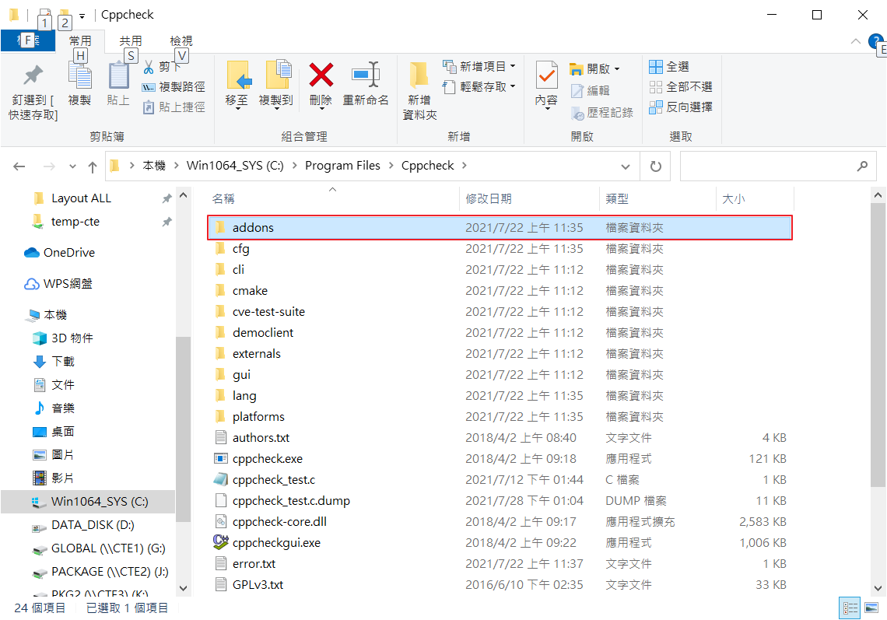
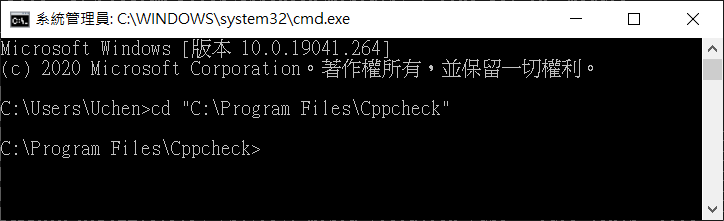
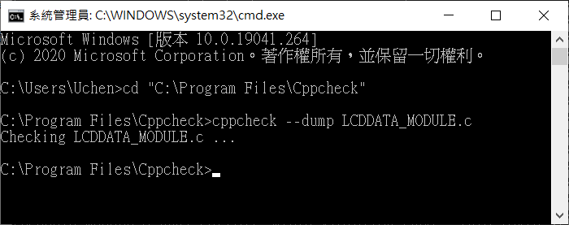
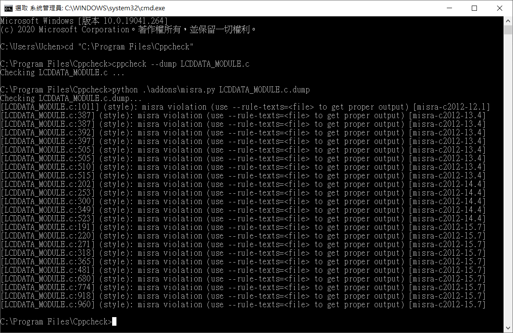

# Cppcheck MISRA簡易操作手冊

## 軟體安裝
* [Cppcheck](http://cppcheck.sourceforge.net/)
* [Python](https://www.python.org/downloads/)
* [addons相關檔案](https://github.com/danmar/cppcheck/blob/main/addons/)

## 操作方法
* Cppcheck及Python安裝完成後，將addons資料夾放至Cppcheck安裝根目錄。

* 開啟命令提示字元，並進入Cppcheck安裝目錄

* 透過指令"cppcheck --dump File.c"產生dump檔

* 透過指令"python .\addons\misra.py File.c.dump"對產生的dump檔進行偵錯

* [功能修改10.X 募資失敗](https://www.kickstarter.com/projects/3300446/add-all-missing-10x-misra-rules)